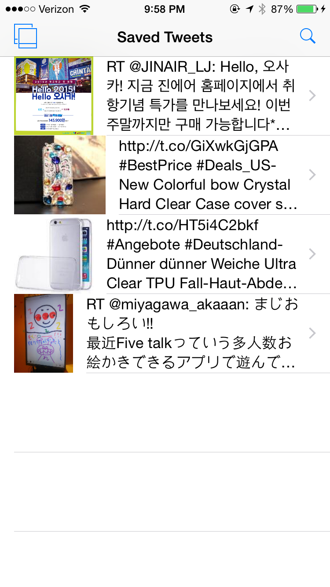

# simple-twitter-client
A simple twitter client that allows you to search and save tweets

Preview
---
You can search tweets and save them by swiping left

view the tweets you saved, delete by swiping left

and view a collection of images from the tweets you saved

Video
---
Links to a few demo videos
- [Video 1](https://www.dropbox.com/s/3t42j9gvssp3ntq/video.mov?dl=0)
- [Video 2](https://www.dropbox.com/s/8f5istg081fyxiq/videoDelete.mov?dl=0)

License
---
simple-twitter-client is available under MIT license. See the LICENSE file for more info.
